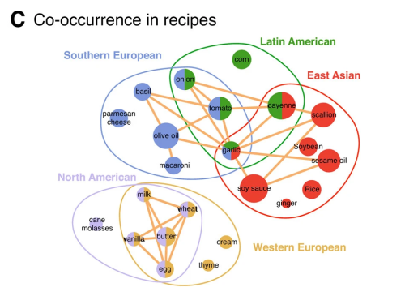

# Food ML - ZKML for Culinary Categories

We trained a deep neural net (DNN) to recognize combinations of ingredients as identifiers for a particular type of cuisine. The model was inspired by [this article](https://www.nature.com/articles/srep00196).

**Sindri's novel proof acceleration techniques provide an essential contribution towards the goal of making nontrivial ZKML feasible.**



After converting the DNN to a Circom ciruit, we provide verified inference via Sindri. Specifically, when you make a query, such as *"what type of cuisine would use macaroni and parmesan?"* and the model returns *"Southern European"*, the response will also include a proof that the answer was achieved by putting your input directly into the model (as opposed to taking any shortcuts).

This particular model is not large; the summary below indicates there were only two dense layers and fewer than 25K trainable parameters. After transpiling, the ZKML circuit has more than 60K constraints. (You can think of proof time as roughly dependent on the number of constraints). The inherent complexity of ML training and inference poses implementation challenges. By encapsulating the models within a ZK-container, we are magnifiying that complexity. It is an [active area](https://github.com/worldcoin/awesome-zkml) of research to accomodate larger models.

```txt
Model: "food_ml"
_________________________________________________________________
 Layer (type)                Output Shape              Param #
=================================================================
 input_9 (InputLayer)        [(None, 374)]             0

 dense_14 (Dense)            (None, 64)                24000

 re_lu (ReLU)                (None, 64)                0

 dense_15 (Dense)            (None, 11)                715

 softmax_8 (Softmax)         (None, 11)                0

=================================================================
Total params: 24,715
Trainable params: 24,715
Non-trainable params: 0
_________________________________________________________________
```

## Instructions

### Setup
1. Clone this repository
1. Set a `SINDRI_API_KEY` environment variable with your API key
   ```bash
   export SINDRI_API_KEY=<YOUR_API_KEY>
   ```
1. Install requirements: `pip install sindri`

### Run
Running the following command will create a circuit and prove it (i.e. the model defined in the `circuit/`) using the Python Sindri SDK.
```bash
python3 compile_and_prove.py
```

Here is an example run:
```txt
Circuit: Create
    circuit_id:   59f353fc-a864-4652-86aa-a1330215bd98
Circuit: Poll until Ready/Failed
Circuit: Get circuit detail for circuit_id: 59f353fc-a864-4652-86aa-a1330215bd98
{   'circuit_id': '59f353fc-a864-4652-86aa-a1330215bd98',
    'circuit_name': 'food-ml',
    'circuit_type': 'circom',
    'compute_time': 'P0DT00H01M00.506670S',
    'date_created': '2023-12-01T18:32:30.093Z',
    'status': 'Ready'}

Ingredient not found: spaghetti
Prove circuit
    proof_id:     bd437999-57b3-47b6-9e58-1a17032d54fb
Proof: Poll until Ready/Failed
Proof: Get proof detail for proof_id: bd437999-57b3-47b6-9e58-1a17032d54fb
{   'circuit_id': '59f353fc-a864-4652-86aa-a1330215bd98',
    'circuit_name': 'food-ml',
    'circuit_type': 'circom',
    'compute_time': 'P0DT00H00M02.478004S',
    'date_created': '2023-12-01T18:33:32.457Z',
    'proof_id': 'bd437999-57b3-47b6-9e58-1a17032d54fb',
    'status': 'Ready'}


Inputted query: mango soy_sauce peanut_butter spaghetti watermelon beef

Expected region: NorthAmerican

Predicted region: NorthAmerican
Done!
Using Sindri Labs' Forge API is EZ!
```

### Play with the input!
Edit the `query_raw` variable in the `compile_and_prove.py` script to change the list of ingredients to ask the model what type of cuisine this most closely adheres to. You can get as creative as you want and the model will still return an answer (although you should also try a few obvious ones to get an idea of how accurate the model is, e.g. `"ginger garlic soy_sauce"` or `"tomato olive_oil basil"`).

Notice from the above example that the vocabulary of our model is somewhat limited. The message `Ingredient not found: spaghetti` appears.

See `vocab.txt` for a full list of all 374 recognizable ingredients. If you enter a list of ingredients and none are recognized, the script will not bother submitting a Sindri proof request.

## References

The training data came from the supplementary data for this [article](https://www.nature.com/articles/srep00196).

The conversion from a trained Keras model to a Circom circuit was straightforward due to this [amazing repository](https://github.com/socathie/keras2circom).
